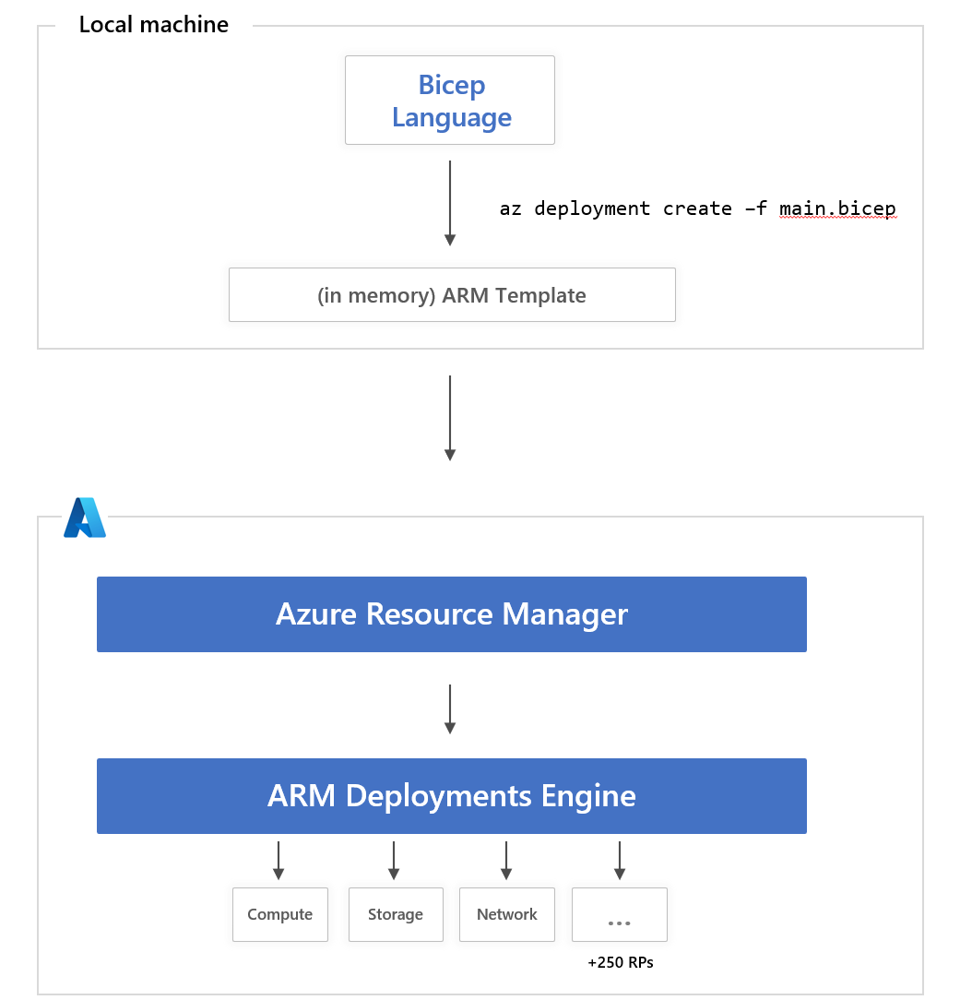
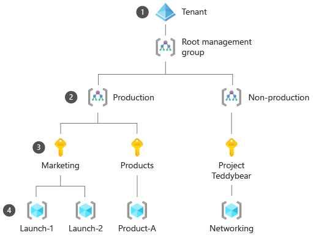
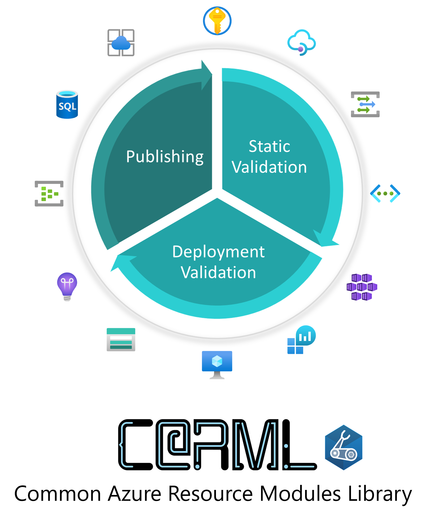
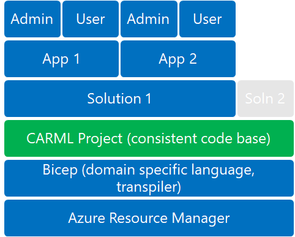

# Deploying Azure Resources with Bicep Scopes

---

## Bicep
Bicep is a domain-specific language (DSL) that uses declarative syntax to deploy Azure resources. Bicep provides concise syntax, reliable type safety, and support for code reuse. 

---

## Scopes

* Resource Groups
* Subscriptions
* Management Groups
* Tenant

---

## Cli Commands to deploy

- az deployment group create --template-file main.bicep
- az deployment sub create --template-file main.bicep
- az deployment mg create --template-file main.bicep
- az deployment tenant create --template-file main.bicep

---

---

## CARML
Modules for almost every Azure Service that is ready to use.
Allows for quick deployment of resources with minimal code.

---

## Identities

Multiple Identities can be used to deploy resources to different scopes or security boundaries. 
Dev SP can deploy to a single dev subscription or resource group.

Single Identities can be used to deploy across scopes or security boundaries. 
A Dev Management Group SP can deploy to multiple Dev Subscriptions and Resource Groups.

